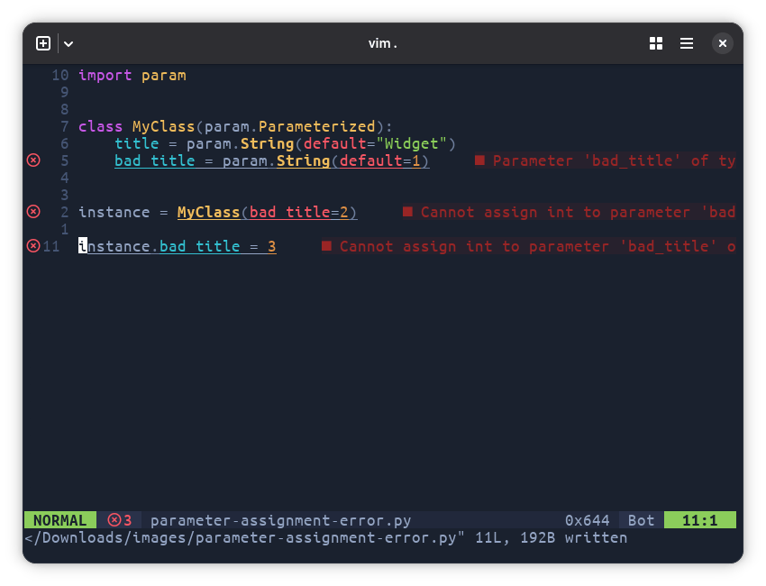
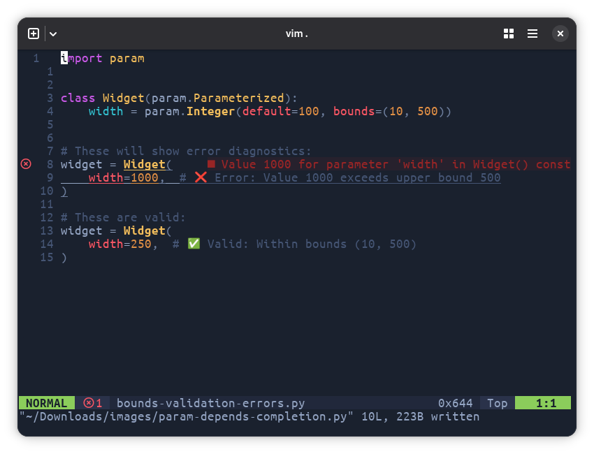

# Type Validation & Diagnostics

param-lsp provides real-time validation of parameter values, types, and constraints with immediate error feedback.

## Type Validation

Catch type mismatches before runtime:

=== "Screenshot"

    

    Error diagnostics with red squiggly lines under invalid values and error tooltips

=== "Code"

    ```python
    import param

    class MyClass(param.Parameterized):
        title = param.String(default="Widget")
        bad_title = param.String(default=1)


    instance = MyClass(bad_title=2)

    instance.bad_title = 3
    ```

**Supported type validations:**

- **String**: Text values, optional regex patterns
- **Integer**: Whole numbers with optional bounds
- **Number**: Numeric values (int/float) with optional bounds
- **Boolean**: True/False values
- **List**: List objects with optional item type validation
- **Dict**: Dictionary objects
- **Tuple**: Tuple objects with optional element validation

## Bounds Checking

Immediate feedback when parameter values violate bounds:

=== "Screenshot"

    

    Error diagnostics with red squiggly lines under invalid values and error tooltips

=== "Code"

    ```python
    import param

    class Widget(param.Parameterized):
        width = param.Integer(default=100, bounds=(10, 500))
        opacity = param.Number(default=1.0, bounds=(0.0, 1.0))

    # These will show error diagnostics:
    widget = Widget(
        width=1000,    # ❌ Error: Value 1000 exceeds upper bound 500
        opacity=1.5    # ❌ Error: Value 1.5 exceeds upper bound 1.0
    )

    # These are valid:
    widget = Widget(
        width=250,     # ✅ Valid: Within bounds (10, 500)
        opacity=0.8    # ✅ Valid: Within bounds (0.0, 1.0)
    )
    ```

**Error messages include:**

- Specific bound violation details
- Expected range information
- Suggested valid values

## Selector Validation

Validation for parameter choices:

```python
import param

class Theme(param.Parameterized):
    style = param.Selector(
        default="light",
        objects=["light", "dark", "auto"]
    )
    size = param.Selector(
        default="medium",
        objects=["small", "medium", "large"]
    )

# This will show error diagnostics:
theme = Theme(
    style="blue",      # ❌ Error: 'blue' not in allowed objects
    size="tiny"        # ❌ Error: 'tiny' not in allowed objects
)

# This is valid:
theme = Theme(
    style="dark",      # ✅ Valid: In allowed objects
    size="large"       # ✅ Valid: In allowed objects
)
```

**Selector features:**

- Choice validation against allowed objects
- Suggestions for similar valid choices
- Case-sensitive matching
- Support for mixed-type choices

## Regular Expression Validation

String parameters with regex constraints:

```python
import param

class FormData(param.Parameterized):
    email = param.String(
        regex=r'^[a-zA-Z0-9._%+-]+@[a-zA-Z0-9.-]+\.[a-zA-Z]{2,}$'
    )
    phone = param.String(
        regex=r'^\+?1?[0-9]{10}$'
    )
    zip_code = param.String(
        regex=r'^\d{5}(-\d{4})?$'
    )

# These will show error diagnostics:
form = FormData(
    email="invalid-email",     # ❌ Error: Doesn't match email pattern
    phone="123",               # ❌ Error: Doesn't match phone pattern
    zip_code="invalid"         # ❌ Error: Doesn't match zip pattern
)
```

## List and Dict Validation

Complex type validation for collections:

```python
import param

class DataConfig(param.Parameterized):
    tags = param.List(
        default=["tag1", "tag2"],
        item_type=str  # Each item must be a string
    )

    metadata = param.Dict(
        default={"version": "1.0", "author": "user"}
    )

    coordinates = param.Tuple(
        default=(0, 0),
        length=2  # Must have exactly 2 elements
    )

# These will show error diagnostics:
config = DataConfig(
    tags=["tag1", 123],        # ❌ Error: Item 123 is not a string
    metadata="not-a-dict",     # ❌ Error: Expected dict, got string
    coordinates=(1, 2, 3)      # ❌ Error: Expected 2 elements, got 3
)
```

## Cross-Parameter Validation

Some validations check relationships between parameters:

```python
import param

class Range(param.Parameterized):
    min_value = param.Number(default=0)
    max_value = param.Number(default=100)

    @param.depends('min_value', 'max_value')
    def _validate_range(self):
        if self.min_value >= self.max_value:
            raise ValueError("min_value must be less than max_value")

# This will show error diagnostic:
range_obj = Range(
    min_value=50,
    max_value=30  # ❌ Error: min_value >= max_value
)
```
